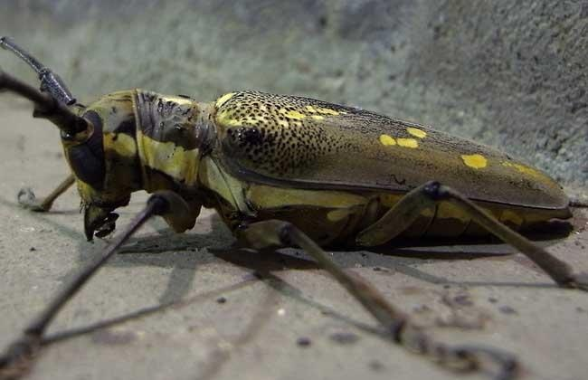
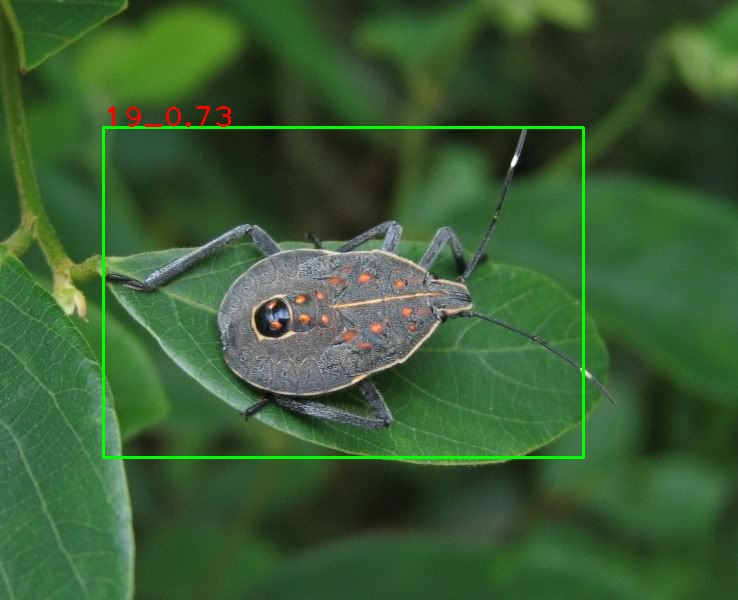
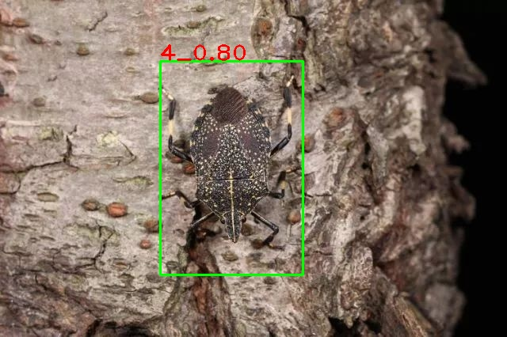
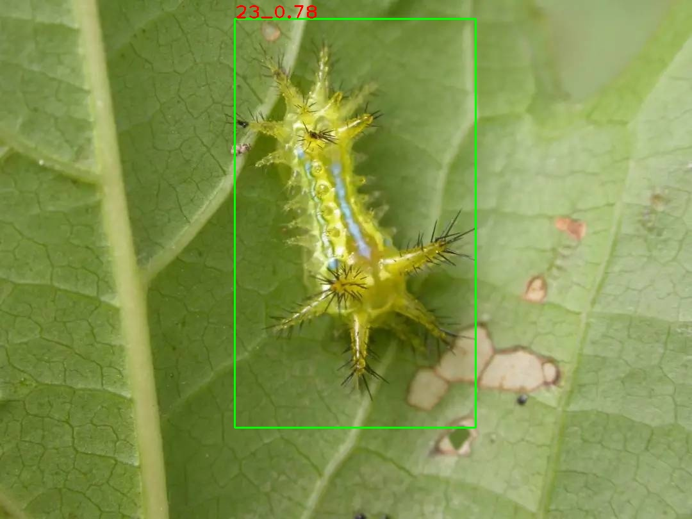

# 使用PeaddlX实现的智慧农业病虫检测项目

在本项目中，使用PaddlX组件，在自制的病虫数据集上，采用ppyolo算法实现了农业的病虫检测。预期成功是将其部署在无人机上，使用无人机巡视农业区并自动化地统计病虫种类数量及时与相关工作人员进行汇报。

具体代码在[pear_detection.ipynb](pear_detection.ipynb)文件中

AI Studio项目连接：[https://aistudio.baidu.com/aistudio/projectdetail/2235186?shared=1](https://aistudio.baidu.com/aistudio/projectdetail/2235186?shared=1)

数据集与预训练模型请自行到AI Studio项目中进行下载

ps:强烈建议到AI Studion中进行项目体验

# 一、项目背景

随着计算机视觉领域的技术不断成熟，越来越多的相关技术落地到实际应用场景中。在智慧农业方面，害虫对作物的侵蚀程度不亚于人类经历的各种灾难，但是与天灾不同，作物受到害虫的侵害是可以经过人工处理后避免的，传统的人工农业管理通常是通过农民手工进行检查和除虫 这种传统的生产已经不能满足现在社会生活的需要。为此，本项目引入了计算机视觉领域的目标检测算法，旨在尽可能多的检测出作物上的病虫，同时将其结果反馈给相关工作人员，使得虫灾及早被发现，及早被解决，将病虫扼杀在萌芽之中。

# 二、数据集介绍

本项目采用的是AIStudio公开数据集中提供的常见病虫识别样本数据集，经过对数据的清洗和格式的重新编写，符合了VOC数据集的格式。

改数据集一共1080张病虫图片，其中训练集864张,验证集162张，测试集54张，共30种不同的病虫类别（区分成虫与幼虫）。

部分数据集数据如下图所示：

# 三、模型选择和开发

在本项目中直接调用PaddleX模型库中目标检测模型，修改好对应的类别信息即可轻松载入模型，在本项目中使用的是PPYOLO模型,采用默认的ResNet50_vd_ssld作为骨干网络

使用PaddleXn提供的训练API快速构建算法网络，开始训练。

# 四、结果展示

在本项目中，只需要在当前的AIStudio中按顺序运行即可成功运行，目前项目完成了检测模型的开发。

最终成果需要部署在无人机上进行病虫检测，然而由于缺乏硬件，因此暂时只能完成检测算法。检测结果如下图所示

（由于昆虫名字过长这里用ID表示，具体是什么昆虫可以查看Pears数据集中的labels.txt和昆虫编号.xlsx）

# 五、总结与升华

首先很荣幸能参加本次飞桨领航团举办的训练营课程，在这里我学习到了很多飞桨提供的组件，其中我最喜欢的组件就是Paddlex，他可以用简单的几行代码，去实现一个模型的训练，预测过程，非常方便。在项目执行过程中也遇到了一些问题，我印象最深刻的就是在训练过程中出现的空指针问题，经过和创造营群内小伙伴的讨论，发现了读取图片为空，然后我返回去检查数据集，发现有两张图片是有文件但是无法读取的，不知道是bug还是文件有问题，反正删了这两张图就可以正常的训练了。

最后，本次创造营活动已经接近尾声，最后为大家带来了我这个不成熟的项目，为智慧农业的病虫检测提供了使用的算法模型，希望在后面的工作中，能将其部署到硬件设备上，完成项目落地。

# 个人简介

名称|介绍
-|-
昵称|Zero Rains
学校|桂林电子科技大学
年级|本科二年级
研究方向|主攻深度学习的计算机视觉方向，做过图像分类，目标检测，语义分割和实例分割等任务
github主页|[https://github.com/zeroRains](https://github.com/zeroRains)
个人博客|[https://blog.zerorains.top](https://blog.zerorains.top)
CSDN主页|[https://blog.csdn.net/kiminoamae?spm=1001.2101.3001.5343](https://blog.csdn.net/kiminoamae?spm=1001.2101.3001.5343)
AI Studio|[我在AI Studio上获得白银等级，点亮2个徽章，来互关呀~ https://aistudio.baidu.com/aistudio/personalcenter/thirdview/382849](https://aistudio.baidu.com/aistudio/personalcenter/thirdview/382849)
联系方式|me@zerorains.top
留言|欢迎各位大佬来互相关注

